<!-- 封面 -->
# 摘要
**MarkDown及mermaid常用笔记**
<!-- 中文和英文摘要，包含关键词 -->
目录
<!-- 使用 [TOC] 生成目录 -->
第一章 绪论
<!-- 描述写作目的，以文字为主，引用他人数据 -->
第二章 需求分析
<!-- 包含饼图 -->
第三章 概要设计
<!-- 包含流程图、类图、数据库表等 -->
第四章 功能实现
<!-- 穿插大量的图片和源代码 -->
第五章 系统测试
<!-- 以表格为主 -->
结束语
<!-- 纯文字部分 -->
致谢
<!-- 纯文字部分 -->
参考文献
<!-- 尾注 -->
摘要
<!-- 语法-->
---

# 目录
[TOC]
列出所有使用#的标题及分层

# 摘要
可以直接输入文本内容进行正常显示。
```
Both English and Chinese can be used directly
```

**关键词**：编辑器，格式化，Markdown。

### 文本语法
可以直接输入文本内容进行正常显示。

- 斜体的演示
  *用星号表示的斜体*
  _用下划线表示的斜体_

- 粗体的演示
  **用星号表示的粗体**
  __用下划线表示的粗体__

~~这是一条删除线~~
当删除线内部紧跟 "空格" 时，删除线效果会失效。
~~有效的删除线~~
~~失效的删除线 ~~

换行<br/>使用`<br/>`换行
输入空格用&nbsp;&nbsp;&nbsp;打出一个 空 格
注释使用HTML的注释<!-- 注释内容 -->，css样式表也可以直接使用

### 实例


# 第一章 绪论

## 1.1 课题背景

[这是一段正文内容]

>引用他人的论点论据，用来佐证本文的背景及意义。
>
>——引文出处，适当增加尾注[^1]

[这是一段正文内容]
这是一段自由文本

## 1.2 信息化管理
## 1.3 系统设计目的和内容

[^1]: 绪论尾注 1 的内容。
# 第二章 需求分析

## 2.1 可行性分析

### 2.1.1 技术可行性

同类产品技术解决方案：

- XX 公司实现的产品，用了 XX 技术；
- XX 公司实现的产品，用了 XX 技术；
- XX 公司实现的产品，用了 XX 技术。

### 2.1.2 经济可行性

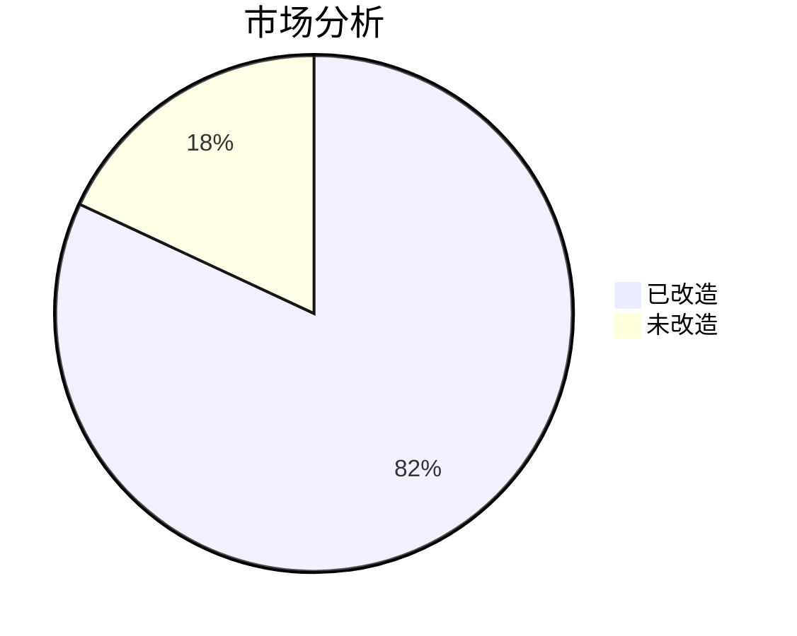

<center>图1：市场分析图</center>

### 2.1.3 管理可行性

## 2.2 需求分析

### 2.2.1 功能需求

- 功能点1
  - 子功能点 1-1
  - 子功能点 1-2
  - 子功能点 1-3
- 功能点2
  - 子功能点 2-1
  - 子功能点 2-2
- 功能点3

### 2.2.2 环境需求

| 需求项   | 需求指标  |
| -------- | --------- |
| 操作系统 | CentOS 7  |
| 数据库   | Mysql 5.7 |
| 内存     | 8G        |
| 硬盘     | 100G      |

## 2.3 数据项分析

数据表整理

| 数据对象 | 简述               | 来源     | 核心数据项   | 主键   |
| -------- | ------------------ | -------- | ------------ | ------ |
| 管理员表 | 保存系统管理员信息 | 注册     | 登录名       | 登录名 |
| 学生表   | 保存学员信息       | 批量导入 | 姓名、学号   | 学号   |
| 老师表   | 保存教职工信息     | 批量导入 | 姓名、职工号 | 职工号 |
| 部门表   | 保存部门、班级信息 | 批量导入 | 名称、编号   | 编号   |

### 2.4 数学计算
使用LaTeX进行公式输出

上标符号：$x^2$  
下标符号：$y_1$  
组合符号：$a^{x^{2}+y^{2}}$  

阿尔法：$\Alpha$，$\alpha$  
贝塔：$\Beta$，$\beta$  
伽玛：$\Gamma$，$\gamma$  
德尔塔：$\Delta$，$\delta$  
艾普西龙：$\Epsilon$，$\epsilon$  
捷塔：$\Zeta$，$\zeta$  
依塔：$\Eta$，$\eta$  
西塔：$\Theta$，$\theta$  
艾欧塔：$\Iota$，$\iota$  
喀帕：$\Kappa$，$\kappa$  
拉姆达：$\Lambda$，$\lambda$  
缪：$\Mu$，$\mu$  
拗：$\Nu$，$\nu$  
克西：$\Xi$，$\xi$  
欧麦克轮：$\Omicron$，$\omicron$  
派：$\Pi$，$\pi$  
柔：$\Rho$，$\rho$  
西格玛：$\Sigma$，$\sigma$  
套：$\Tau$，$\tau$  
宇普西龙：$\Upsilon$，$\upsilon$  
发艾：$\Phi$，$\phi$  
器：$\Chi$，$\chi$  
普赛：$\Psi$，$\psi$  
欧米伽：$\Omega$，$\omega$  

加法符号：$x+y=z$  
减法符号：$x-y=z$  
加减符号：$x \pm y=z$  
减加符号：$x \mp y=z$  
叉乘符号：$x \times y=z$  
点乘符号：$x \cdot y=z$  
星乘符号：$x \ast y=z$  
除法符号：$x \div y=z$  
斜除符号：$x/y=z$  
分式1：$\frac{x+y}{y+z}$   
分式2：${x+y} \over {y+z}$  
绝对值：$|x+y|$ 

**步骤推演：**
$$
x + y = 10 \\
x - y = 6 \\
2x = 16 \\
x = 8 \\
y = 2
$$


等于符号：$x+y=z$  
大于符号：$x+y>z$  
小于符号：$x+y<z$  
大于等于符号：$x+y \geq z$  
小于等于符号：$x+y \leq z$  
不等于符号：$x+y \neq z$  
不大于等于符号：$x+y \ngeq z$  
不大于等于符号：$x+y \not\geq z$  
不小于等于符号：$x+y \nleq z$  
不小于等于符号：$x+y \not\leq z$  
约等于符号：$x+y \approx z$  
恒定等于符号：$x+y \equiv z$  

平均数符号：$\overline{xyz}$   
开二次方符号：$\sqrt x$       
开方符号：$\sqrt[3]{x+y}$   
对数符号：$\log(x)$  
极限符号：$\lim^{x \to \infty}_{y \to 0}{\frac{x}{y}}$  
极限符号：$\displaystyle \lim^{x \to \infty}_{y \to 0}{\frac{x}{y}}$  
求和符号：$\sum^{x \to \infty}_{y \to 0}{\frac{x}{y}}$  
求和符号：$\displaystyle \sum^{x \to \infty}_{y \to 0}{\frac{x}{y}}$  
积分符号：$\int^{\infty}_{0}{xdx}$  
积分符号：$\displaystyle \int^{\infty}_{0}{xdx}$ 
微分符号：`\partial`，如：$\frac{\partial x}{\partial y}$  
矩阵符号：$\left[ \begin{matrix} &1 &2 &\cdots &4 &5 &6 &\cdots &8\\ &\vdots &\ddots &\cdots &13 &14 &15 &\cdots &16\end{matrix} \right]$

**文字上下标：**
使用sup标签<sup>上标</sup>
使用sub标签<sub>下标</sub>
结合使用<sup>上1<sub>上1的下<sup>上1的下的上2</sup></sub></sup>

#### 实例
_LaTeX:_
$$
a_n = a_1q^{n-1}= \frac {a_1}{q} \cdot q^n(n \in N^*) \\
其中前 n 项的和公式为：\\
S_n = \left\{ 
\begin{aligned}
\frac {a_1 \cdot (1-q^n)}{1-q} &,q \neq 1 \\
na_1 &,q=1
\end{aligned}
\right.
$$

_上下标:_

你的美（镁）偷走了我的<font color="red">❤</font>（锌)!!!
Mg + ZnSO<sub>4</sub> == MgSO<sub>4</sub> + Zn


# 第三章 概要设计

## 3.1 数据表设计

**管理员表**

管理员表的描述文字。

*表1：管理员表结构*
在表头线左右使用`:`决定左右对齐，两边都写为居中
| 列名     | 数据类型    | 长度 | 非空 | 主键 |
| :--------: | ----------- | ---- | ---- | ---- |
| id       | UUID        | 64   | √    | √    |
| account     | VARCHAR(32) | 32   | √    |      |
| password | VARCHAR(32) | 32   |      |      |

**学生信息表**

学生信息表的描述文字。

*表2：管理员表结构*

| 列名     | 数据类型    | 长度 | 非空 | 主键 |
| -------- | ----------- | ---- | ---- | ---- |
| id       | UUID        | 64   | √    | √    |
| name     | VARCHAR(32) | 32   | √    |      |
| age | Integer | 8   |      |      |

## 3.2 数据表关系图

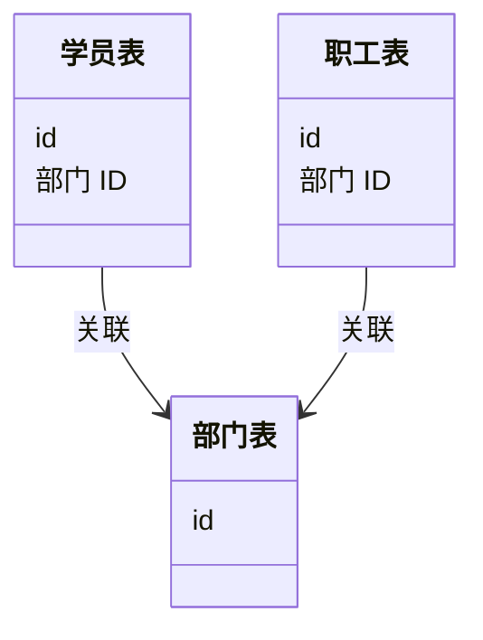

<center>图3-1：数据关系表</center>

## 3.3 功能结构图

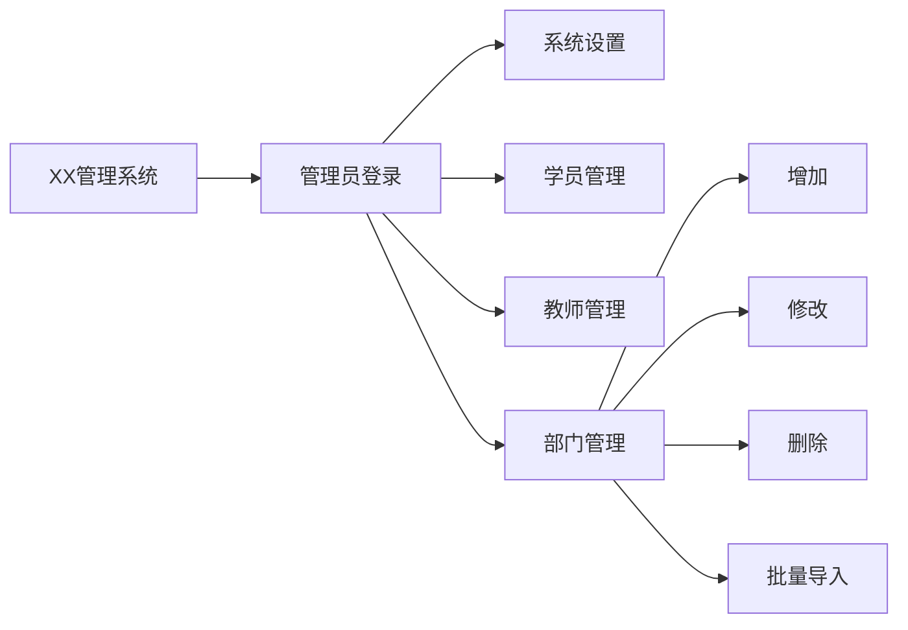

<center>图3-2：功能结构图</center>

# 第四章 功能实现

## 4.1 后台代码实现

```
普通代码块，在上面的```后可以声明使用的代码语言
如果Markdown支持该语言则进行编译
如：使用mermaid绘图
```
一段文字中也可使用` `` `使用代码如：`code`

```python
print("Hello Markdown！")
```

```java
public class Starter {
	public static void main(String[] args) {
  	System.out.println("Hello world");
  }
}
```
## 4.2 前端代码实现


前端html代码：

```html
<!DOCTYPE HTML>
<html>
    <head></head>
    <body>
        <p>Hello World</p>
    </body>
</html>
```
前端脚本代码：

```javascript
function main(){
    alert("Hello world!");
}
```

## 4.3 配置文件代码

properties 类型的配置文件：

```properties
jdbc.driver=com.mysql.jdbc.Driver
jdbc.url=jdbc:mysql://localhost:3306/helloworld?characterEncoding=utf8
jdbc.username=root
jdbc.password=root
```

## 4.4 运行及启动日志


```bash
java Starter
---
Hello World
```

网页截图：


<center>图4-1：访问效果图</center>

<div align="center">
shjshj

</div>


# 第五章 系统测试

## 5.1 功能点完成情况对照

- [x] 数据库创建
- [x] 后端开发
- [x] 前端开发
- [x] 接口联调
- [ ] 日志归档

## 5.2 测试结果

| 功能点       | 是否测试                     | 是否通过                     | 备注 |
| ------------ | ---------------------------- | ---------------------------- | ---- |
| 登录         | <font color="green">√</font> | <font color="green">√</font> | 无   |
| 登出         | <font color="green">√</font> | <font color="red">×</font>   | 无   |
| 增加学员信息 | <font color="red">×</font>   | <font color="red">×</font>   | 无   |

多次引用[^1]
本文重要引用[^2]
mermaid官方文档[^3]

___

# mermaid语法

部分引用至[^4]

## mermaid可绘制的图像
- 饼状图：pie
- 流程图：graph 或flowchart
- 时序图：sequenceDiagram
- 甘特图：gantt
- 类图：classDiagram
- 状态图：stateDiagram
- 旅程图：journey

## 饼状图
### 语法
- 从pie关键字开始图表
- 然后使用title关键字及其在字符串中的值，为饼图赋予标题。（这是可选的）
数据部分
- 在" "内写上分区名。
- 分区名后使用:作为分隔符
- 分隔符后写上数值，最多支持2位小数——数据会以百分比的形式展示
颜色
- 随机分配8种颜色
- 使用&&来单行注释
- 使用`graph` 或者`flowchart`来指定图的方向


### 实例
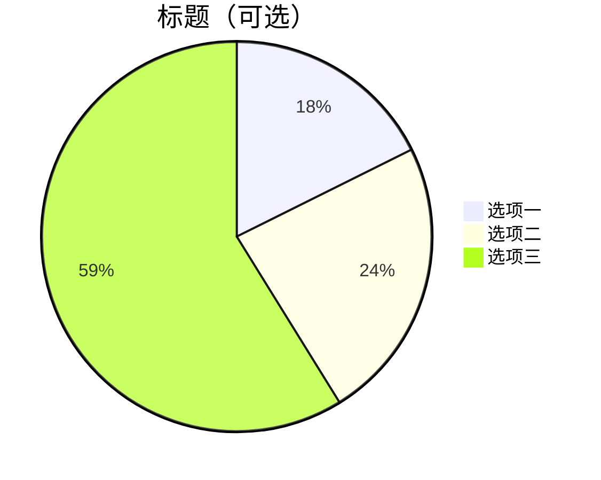

## 流程图
### 语法
- `graph TB`或`TD`或默认`即只写graph`：从上往下
- `graph BT`：从下往上
- `graph LR`：从左往右
- `graph RL`：从右往左
  
### 结点连线
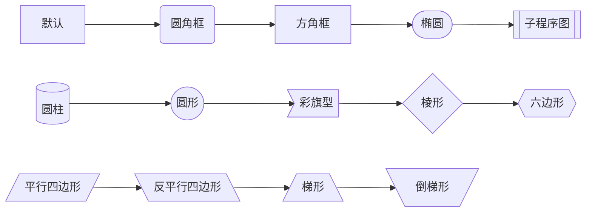
### 连接线类型
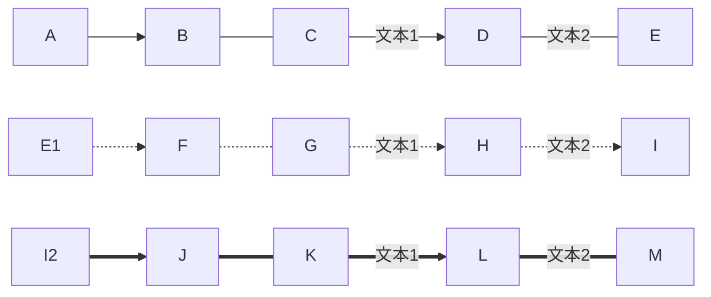
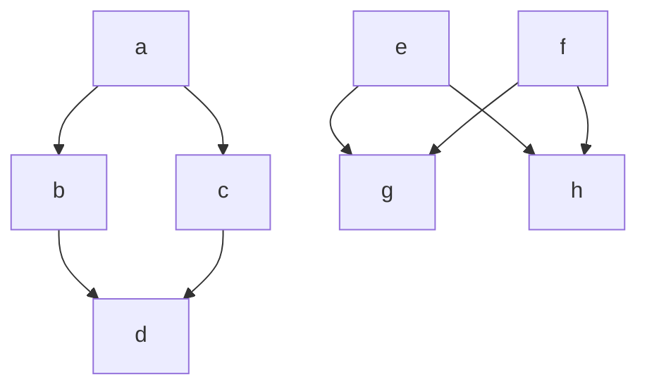
线条长度通过添加`-`, `=`, `.`来增加

| 长度     | 1   | 2   | 3   |
| -------  | -   | -   | -   |
|普通直线   | --  | --- | ----|
| 普通加箭头| --> | --->| ---->|
| 加粗线    | === |==== |=====|
| 粗线加箭头|==>  |===>  |====>|
| 虚线      |-.- |-..-  |-...-|
| 虚线加箭头|-.-> |-..-> |-...->|


### 特殊符号使用
使用html支持的名字或使用unicode字符代码表示这里使用`#quote` `#9798` `#9729`


##### 实例：家谱图(圆形为重要结点)
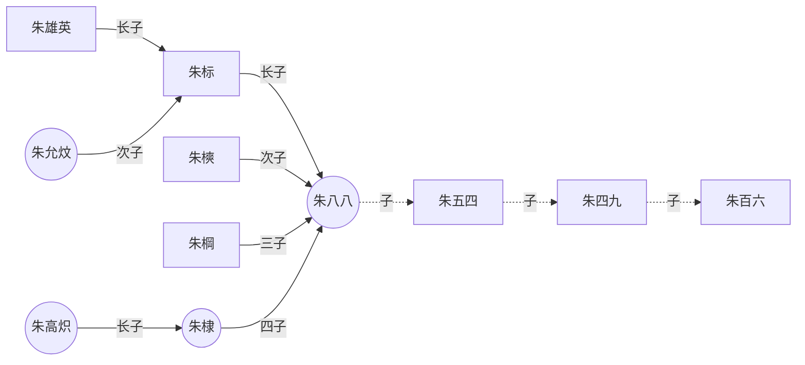
### 子图
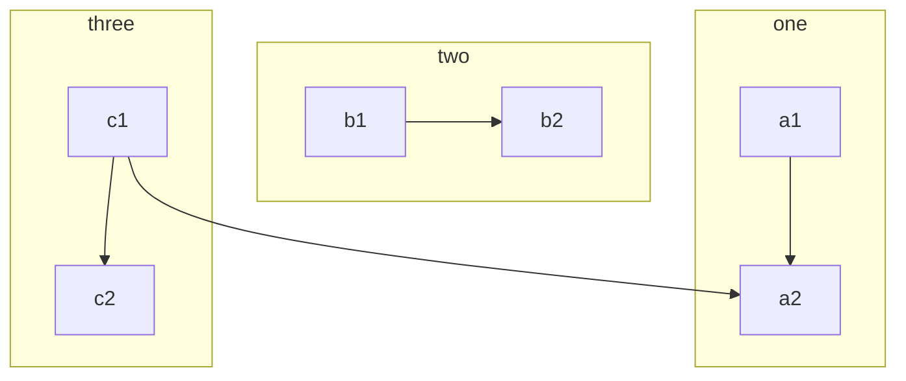
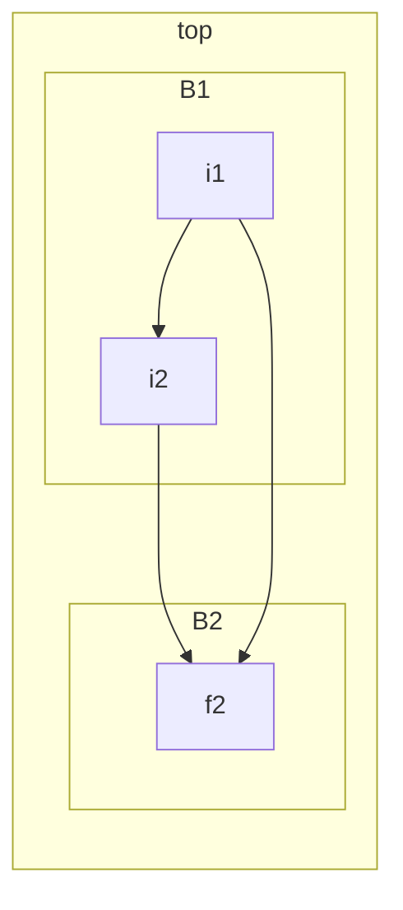
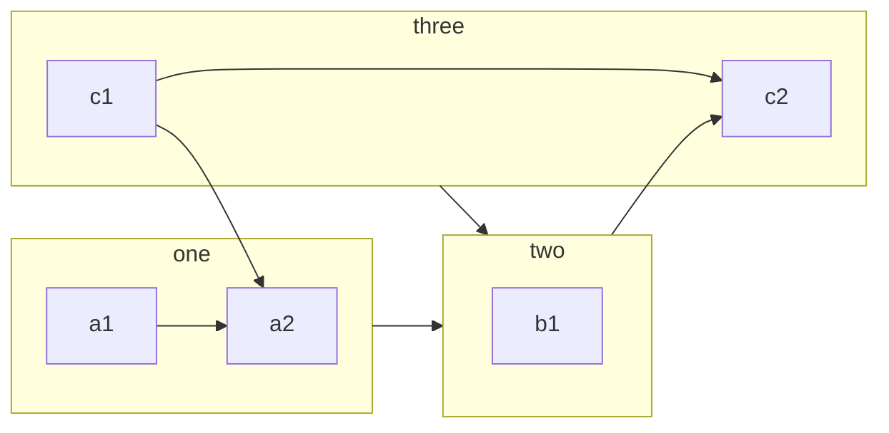
### 自定义的CSS中的style & class
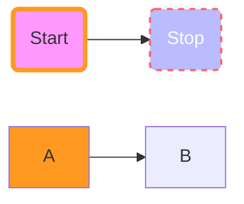

### 常用实例
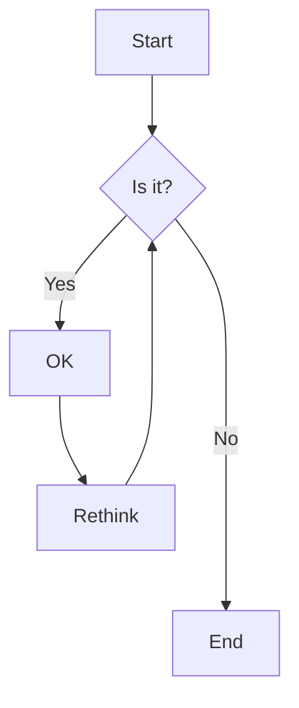


## 时序图
### 实例
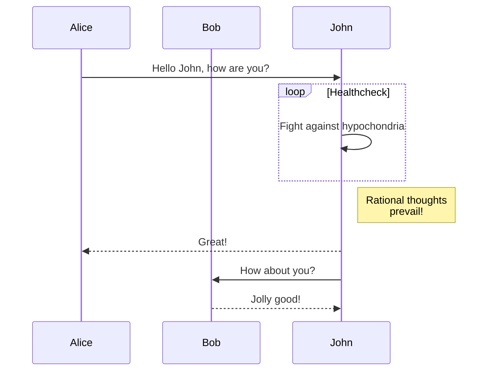
### 常用实例
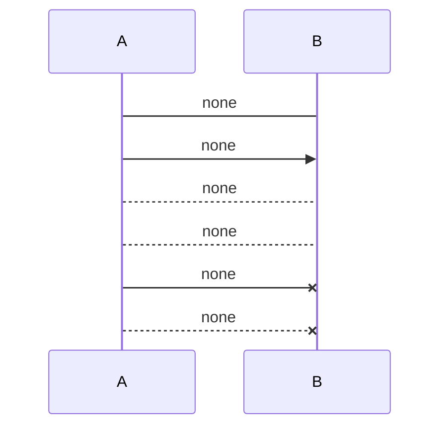
## 甘特图
### 实例
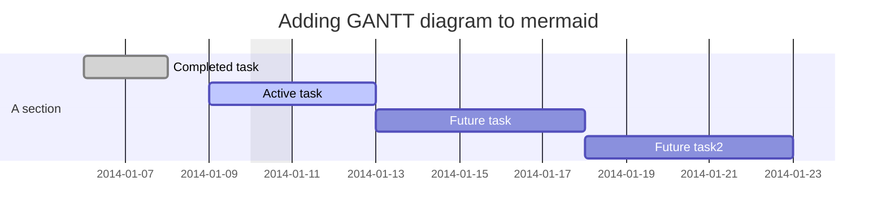
## 类图
### 实例
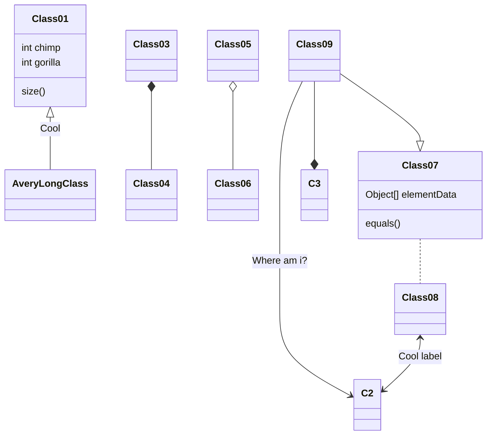

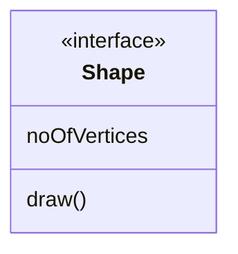
## 状态图
### 实例
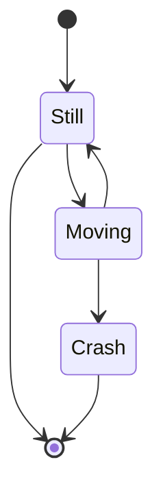
```mermaid
stateDiagram
    direction LR
    [*] --> A
    A --> B
    B --> C
    state B {
      direction LR
      a --> b
    }
    B --> D
```


```mermaid
stateDiagram-v2
    [*] --> Still
    Still --> [*]
%% this is a comment
    Still --> Moving
    Moving --> Still %% another comment
    Moving --> Crash
    Crash --> [*]
```
## 旅程图
### 实例
```mermaid
journey
    title My ordinary day
    section 起床干活
        吃个早饭: 5: Me
        打开电脑和平板: 3: Laptop,pad
        开始干活: 1: Me, Laptop,pad
    section 收工开玩
        原！L！打牌！: 7: Me,Laptop,pad
        玩手机等睡觉: 4: Me,pad
```
# 参考 文献
超链接参考<a href="https://mp.weixin.qq.com/s/54Wj832vi8k5G7jnxNFlkw?">《投资人重视的市场规模，是这样计算的》</a>
[^1]: MarkDown官方文档：https://markdown.com.cn/cheat-sheet.html
[^2]: 慕课教程：https://www.imooc.com/wiki/markdownlesson/markdowndemo.html
[^3]: mermaid文档：https://mermaid-js.github.io/mermaid/#/
[^4]: leancode,程序员画图 - mermaid(流程图),https://zhuanlan.zhihu.com/p/440934038